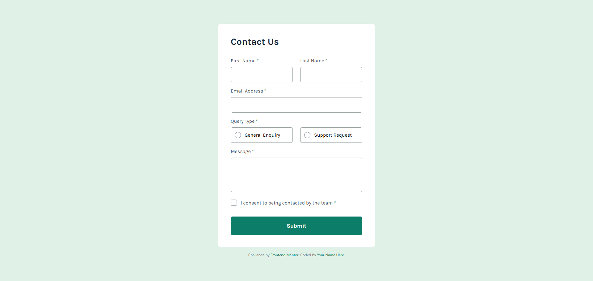

# Frontend Mentor - Contact form solution

This is my solution to the [Contact form challenge on Frontend Mentor](https://www.frontendmentor.io/challenges/contact-form--G-hYlqKJj).

## Table of contents

- [Overview](#overview)
  - [The challenge](#the-challenge)
  - [Screenshot](#screenshot)
  - [Live Site](#live-site)
- [My process](#my-process)
  - [Built with](#built-with)
  - [What I learned](#what-i-learned)
  - [Continued development](#continued-development)
  - [Useful resources](#useful-resources)
- [Author](#author)

## Overview

### The Challenge

Users should be able to:

- Complete the form and see a success toast message upon successful submission
- Receive form validation messages if:
  - A required field has been missed
  - The email address is not formatted correctly
- Complete the form only using their keyboard
- Have inputs, error messages, and the success message announced on their screen reader
- View the optimal layout for the interface depending on their device's screen size
- See hover and focus states for all interactive elements on the page

### Screenshot



### Live Site

- Live Site URL: [Add Later](https://your-live-site-url.com)

## My process

### Built with

- [React](https://reactjs.org/) - JS library for building user interfaces.
- [TypeScript](https://www.typescriptlang.org/) - Superset of JavaScript adding static typing.
- [Tailwind CSS](https://tailwindcss.com/) - Utility-first CSS framework for rapid styling.
- Semantic HTML5 markup.
- CSS Flexbox & Grid.
- Mobile-first workflow.
- [Vite](https://vitejs.dev/) - Frontend tooling for development and builds.

### What I learned

This project was a valuable exercise in applying core React concepts and ensuring form accessibility:

1.  **State Management with Controlled Components:** I utilized the `useState` hook to manage the state for each form input. By binding input values to state and updating them through `onChange` handlers, I created controlled components. This approach centralizes form logic and simplifies validation processes.

    ```typescript
    const [email, setEmail] = useState("");
    // ...other form field states

    const handleChange = (event: ChangeEvent<HTMLInputElement | HTMLTextAreaElement>) => {
        const { name, value } = event.target;
        // Logic to update the appropriate state variable (e.g., setEmail)
    };

    // Example usage in JSX:
    <input
        type="email"
        id="email"
        name="email"
        value={email} // Bound to the email state
        onChange={handleChange} // Updates state on change
        // ... other attributes
    />
    ```

2.  **Form Validation Strategy:** I implemented a `validateForm` function triggered during form submission (`handleSubmit`) and when individual fields lose focus (`handleBlur`). This ensures users receive immediate feedback on errors and helps maintain data integrity. Validation errors are tracked in a dedicated state object and displayed conditionally near the relevant fields.

3.  **Prioritizing Accessibility (ARIA):** Accessibility was a key focus. I incorporated ARIA attributes such as `aria-required`, `aria-invalid`, and `aria-describedby` to clearly communicate field requirements, validation states, and associated error messages to assistive technologies. The radio button group was correctly defined using `role="radiogroup"` and `aria-labelledby`, while feedback messages utilize `role="alert"` for proper screen reader announcement.

4.  **Crafting Custom Controls with Tailwind CSS:** A significant aspect of this project was recreating the custom radio buttons and checkboxes from the design using Tailwind CSS. The technique involved styling custom visual elements while hiding the default browser inputs (`appearance-none`, `opacity-0`) but retaining their functionality. Tailwind's `peer` and `peer-checked` utility classes were instrumental in applying styles conditionally based on the hidden input's state.

    ```html
    {/* Example: Custom Radio Button Structure */}
    <label htmlFor="general-enquiry" class="relative flex items-center ...">
      <input
        type="radio"
        id="general-enquiry"
        name="query-type"
        value="General Enquiry"
        className="peer absolute h-5 w-5 appearance-none ..." // Hidden but functional
        aria-required="true"
      />
      {/* Visual replacement: border styled with Tailwind */}
      <span
        class="absolute top-1/2 left-3 h-5 w-5 ... border border-gray-400 peer-checked:border-emerald-600"
        aria-hidden="true"
      ></span>
      {/* Visual replacement: selected indicator */}
      
      <span class="ml-8 ...">General Enquiry</span>
    </label>
    ```

5.  **Iterative Refinement:** Developing the custom controls involved an iterative process. I frequently used browser developer tools to inspect elements, tweak styles, and fine-tune the positioning and appearance to precisely match the design specifications.

### Continued development

For future improvements, I would consider:

- Integrating a form management library like React Hook Form or Formik to further simplify validation and state handling.
- Adding unit and integration tests.
- Implementing actual submission logic to a backend or serverless service.

### Useful resources

- [Tailwind CSS Documentation](https://tailwindcss.com/docs) - The official docs were essential for applying styles and understanding `peer` variants.
- [WAI-ARIA Authoring Practices](https://www.w3.org/WAI/ARIA/apg/) - A fundamental guide for implementing correct accessibility patterns.
- [React Documentation](https://react.dev/) - Constant reference for hooks and event handling.

## Author

- Email: felipearce.2004@gmail.com
- Linkedin - [Felipe Arce](www.linkedin.com/in/felipe-arce-aqueveque-5b5485292)
